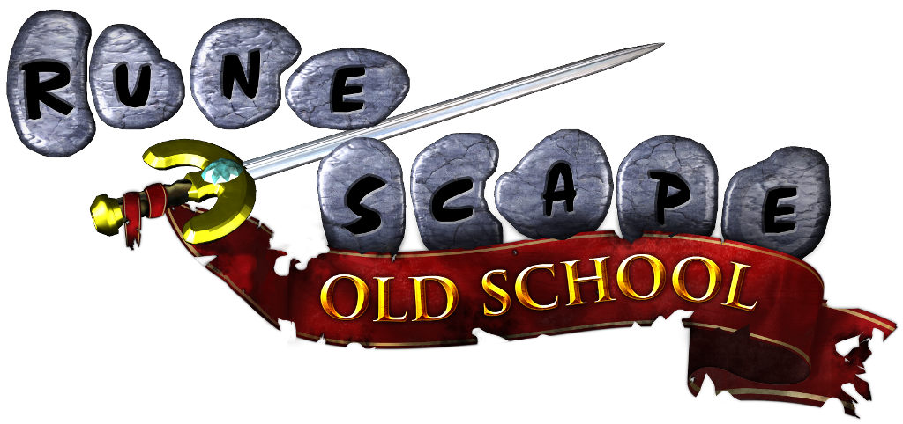
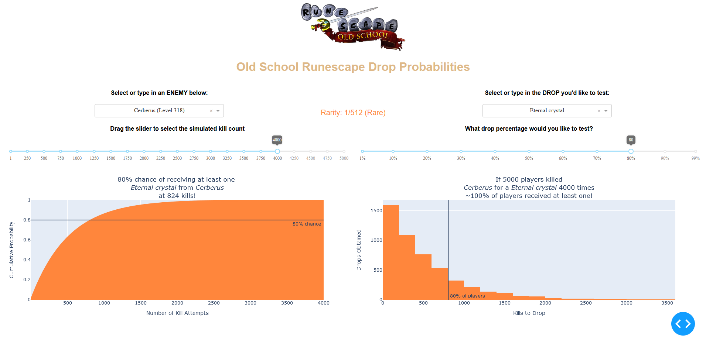

# OSRS-Drop-CDF

## Purpose
This program allows you to explore the statistics of Old School Runescape monster drop rates. You can test different kill counts and percentages to see your estimated probabilities of going on or off rate!

## Changes In Progress
* Fix the histogram functionality where it will constantly update even if a slider is clicked on in the same position.
* Implement objects such as the Lunar Chest, Chest (Tombs of Amascut), etc. 

## Dashboard Screenshot

## Package Installation
It is HIGHLY recommended to use a virtual environment and use:
`pip install -r requirements.txt` 
to obtain the required packages and version as easily as possible.

## What's a CDF?
Check it out [here](https://en.wikipedia.org/wiki/Cumulative_distribution_function)!

Please reach out to me if you have feedback, bug reports, etc! This project is my very first foray into Dash apps, and I have zero experience with the OSRS Wiki APIs (feel free to fork and help out in that sense for getting the JSONs updated).
